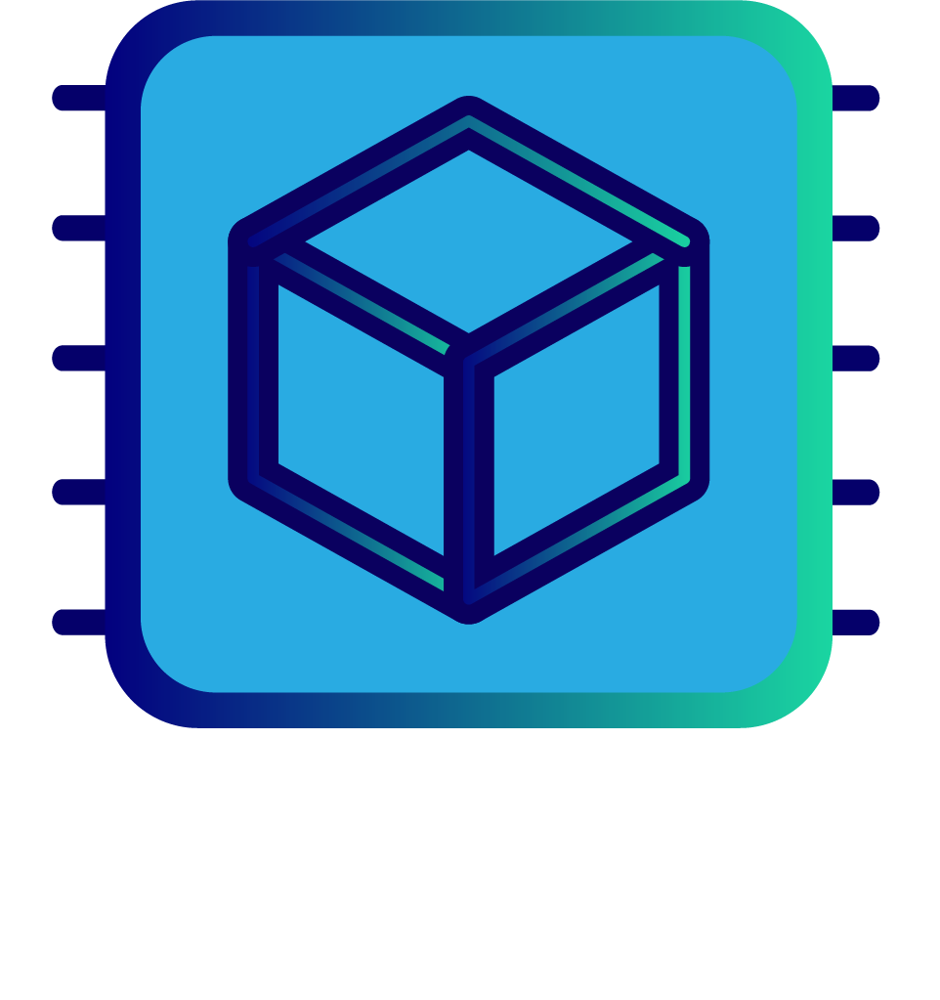

import HomepageTemplate from 'gatsby-theme-carbon/src/templates/Homepage';
export default HomepageTemplate;

 

<Row className="mock-gallery">
<Column colMd={2} colLg={2}>

</Column>
<Column colMd={4} colLg={4}>

</Column>
<Column colMd={4} colLg={4}>

</Column>
</Row>

## What is MCAS?

MCAS is an advanced in-memory object store designed from the ground up
to leverage Persistent Memory and RDMA network technology.  The result,
unprecedented performance for operations on durable multi-TB data.

At the core of MCAS is a sequentially consistent sharded data architecture.
Except for large DMA transfers, <strong>put</strong>, <strong>get</strong> and <strong>invoke</strong> operations are made synchronously.  That is, when
an operation returns, the data has been fully transferred and (in the case
of write) made fully persistent.

## Key Use-cases

* Real-time analytics and unpredictable workloads
* Distributed durable metadata (e.g., as a replacement for etcd)
* Data aggregation (e.g. Deep Learning parameters)

## Key Features

* Over 20M synchronous random read IOPS at less than a 7usec round-trip.
* Over 10M synchronous random write IOPS at less than 10usec round-trip.
* Support for basic key-value API (C++, Python).
* Plugin architecture for Active Data Objects that allow deployment of data-specific operations executable in-store (C++, Python and other languages).
* Deployable on both plain TCP/IP sockets and high-performance RDMA (ibverbs).
* Zero-copy transfer of data when deployed on RDMA networks, supporting GPU-direct and other direct to device DMA technology.
* Fast primary index based on a crash-consistent hash table.
* Support for optional secondary indexes for range scans etc.
* Support for DRAM (without durability) and Intel Optane DC Persistent Memory.

    
